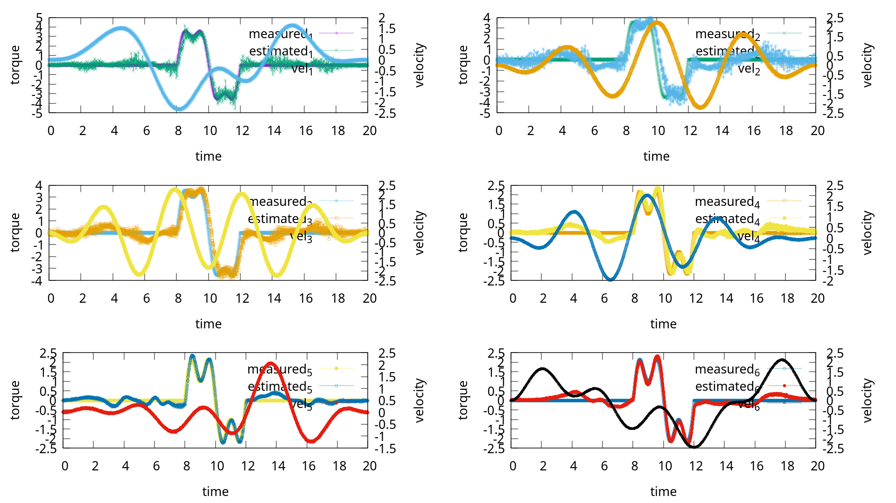
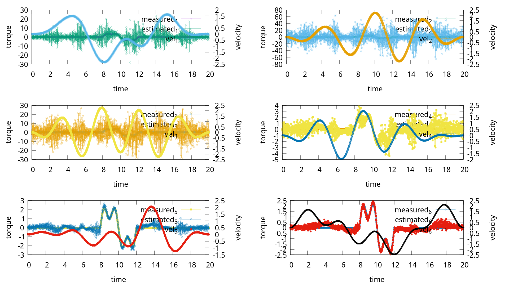
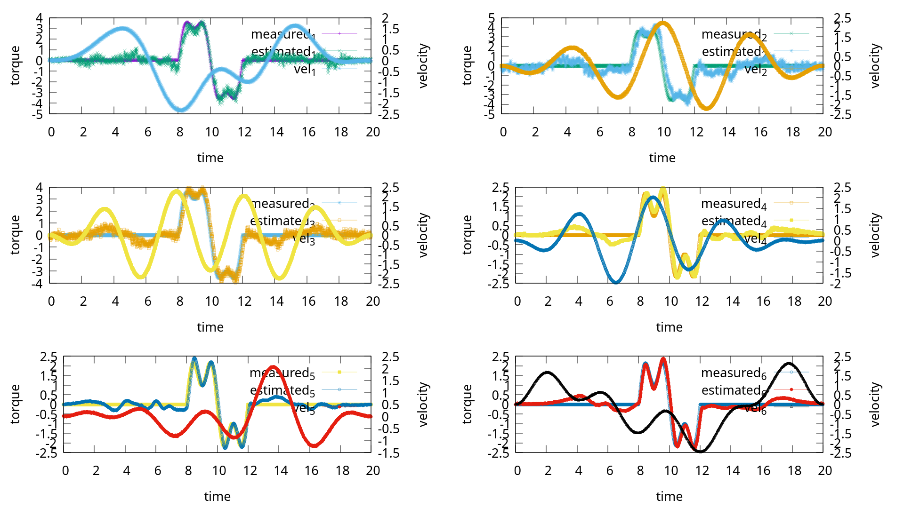
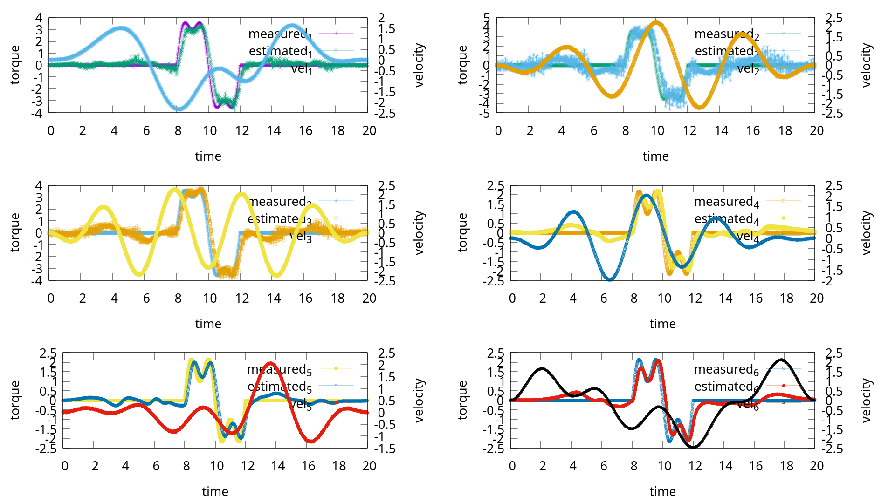
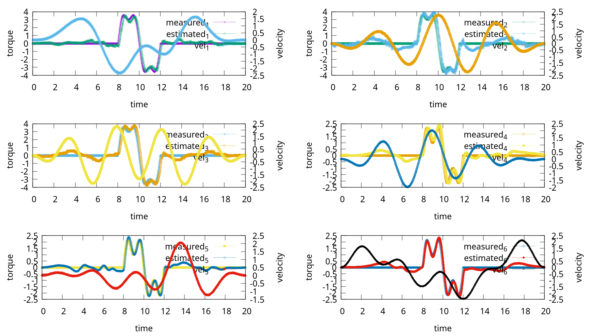
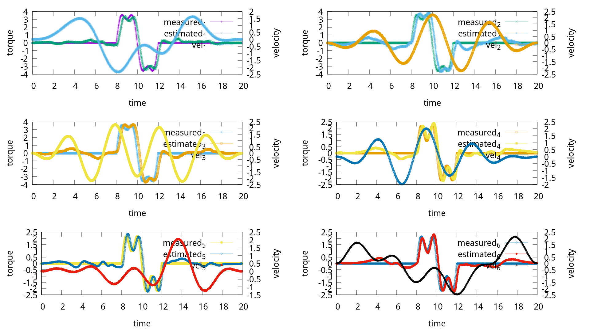

# UR5 External Force Estimation

* Implement the external force estimation algorithm based on disturbance observer in UR5 in Copeliasim.

## Implementation Detail

* Based on the dynamic parameter identification result of the UR5 robot in he Coppeliasim.
* Simulation data containing position, velocity, acceleration and joint torque is collected in the Coppeliasim with the physic engine **Bullet2.83**. In simulation, there are no friction.
* All data is collected without any external force. Apply the external force artificially in the <a href="./src/UR5EstimateForceEstimation.cpp" target="L111-120">code</a>, then use the disturbance observer to estimate the external force.

## Command

```bash
# Dependency to plot the result.
sudo apt-get install gnuplot

# Compile
cd forceEstimation
mkdir build
cmake ..
make

# Usage
./bin/UR5EstimateForceEstimation -h                                           
Allow options:
  -h [ --help ]                        Turn the gain parameter for external 
                                       observer.
  -e [ --externalTorqueType ] arg      external torque type: const or vary
  -p [ --parameterType ] arg (=normal) parameter type: normal, small or big.
  -i [ --inputFile ] arg               input file for external observer.
  -o [ --outputFile ] arg              output file for saving data.
  -f [ --frequency ] arg (=100)        sample Frequency
  -t [ --observerType ] arg            observer type:
                                            0: momentum observer
                                            1: nonlinear observer
                                            2: sliding mode observer
                                            3: filtered dynamic observer
                                            4: kalman filter observer(Tayler)
                                            5: kalman filter observer(Zero 
                                       order filter)

# Example
./bin/UR5EstimateForceEstimation -e vary -p normal -i 6_2000.csv -o 111.csv -t 2
```

## Example

|               Method               |                                  Result                                  |
| :---------------------------------: | :----------------------------------------------------------------------: |
|          Momentum Observer          |                  |
|         Nonlinear Observer         |                |
|        Sliding Mode Observer        |              |
|      Filtered Dynamic Observer      |          |
|   Kalman Filter Observer (Tayler)   |      |
| Kalman Filter Observer (Zero Order) |  |

## Reference

* [ext_observer](https://github.com/mikhel1984/ext_observer)
* [Research on Dynamic Parameter Identification and Admittance Control of Collaborative Robots: Chapter3](https://kns.cnki.net/kcms2/article/abstract?v=_ISxPpdig3yHcy1igQMmBYJAB7La8E6_CSFrn0M_JmVcgqXeURCPQNyu5-cbvg7Hnw7OCdMhkpj3CE4yHLWqM-mZsQXeMS6OTul_6JXOE1JEpojxf2HWNmlUr4dZqL3K-rqogyijptLcfSIZHCTi250_4XW03fUsA_3wQ7wv6EvU6heWhsYcavV5Z7wE7RZE&uniplatform=NZKPT&language=CHS)
* [Cartesian Contact Force Estimation for Robotic Manipulators using Kalman Filters and the Generalized Momentum](https://ieeexplore.ieee.org/document/7294266)
* [A Nonlinear Disturbance Observer for Robotic Manipulators](https://ieeexplore.ieee.org/document/857974)
* [Motor-Current-Based Estimation of Cartesian Contact Forces and Torques for Robotic Manipulators and Its Application to Force Control](https://ieeexplore.ieee.org/document/7914641)
* [Discrete-Time Solutions to the Continuous-Time Differential Lyapunov Equation With Applications to Kalman Filtering](https://ieeexplore.ieee.org/document/6887356)
* [Estimating Robot End-Effector Force from Noisy Actuator Torque Measurements](https://ieeexplore.ieee.org/document/5980210)
* [Sliding Mode Momentum Observers for Estimation of External Torques and Joint Acceleration](https://ieeexplore.ieee.org/document/8793529)
